Erick Alexander Tocay Mayén
202200167

# Manual de instalación de Ubuntu
Ubuntu es una distribución de código abierto del sistema operativo Linux, disponible para cualquier usuario sin costo adicional tanto para versione de servidores como para versiones ordenadores personales.
Es una de las distribuciones mas famosas de este sistema operativo, debido a su versatilidad, ya que es posible usarse día a día sin tener mucho conocimiento dentro del campo de informática.  Por ejemplo, la versión de computadoras viene con soporte para interfaces gráficas y programas típicos de ofimática. La versión para servidores solo admite el trabajo por medio de la terminal del distribuidor.

Para utilizar Ubuntu en una computadora se puede realizar de dos maneras: instalar la ISO directamente en la computadora (como Windows) o por medio de la virtualización. Esta ultima es la mas oportuna si lo que se quiere es experimentar con Linux o si solamente se desea mantener dos o mas sistemas operativos a la vez. En este manual se utilizará la virtualización de Linux en la distribución de Ubuntu por medio de VirtualBox. 

### Instalación del Sistema Operativo (Ubuntu)
Antes de instalar Ubuntu en la máquina virtual es importante los requisitos mínimos para su correcto funcionamiento: 
*	Procesador de 64 bits compatible con virtualización (debe estar activada en la bios).
*	8gb o mas de memoria RAM.
*	50gb de espacio de almacenamiento libre. 
*	Conexión a internet. 
*	VirtualBox instalado. 

Luego de confirmar los requisitos del sistema descargamos la ISO de Ubuntu en el sitio oficial o presionando clic [aqui](https://ubuntu.com/download). 

Ahora descargamos la última versión estable de VirtualBox (seleccionamos el sistema operativo de la computadora): 
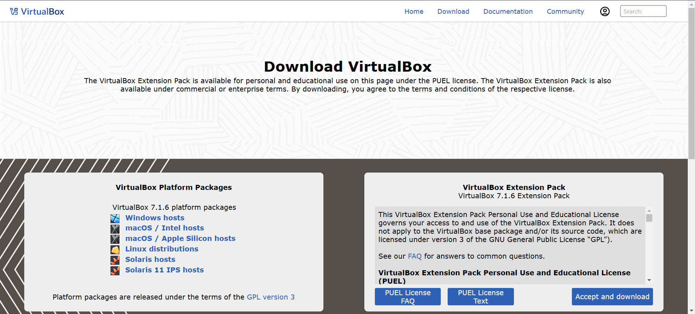

Como siguiente paso debemos iniciar el ejecutable de VirtualBox y presionar el botón “Siguiente” y “Aceptar” hasta que el programa ejecute. Una vez ejecutado el programa presionamos el botón “Nueva”:
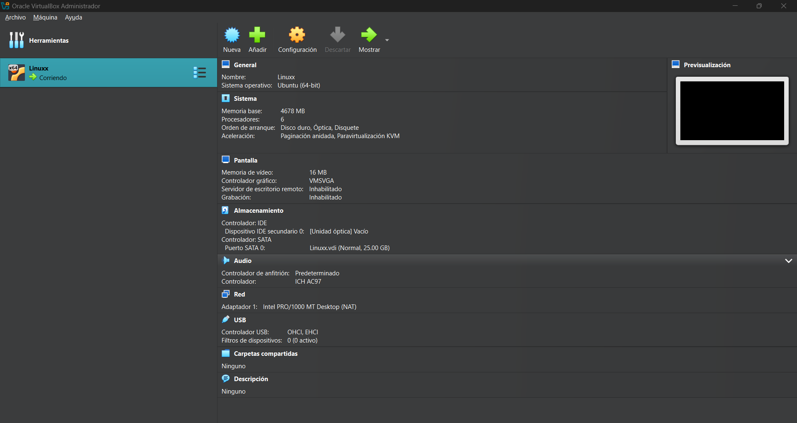

Luego en el apartado de “Nombre” escribimos el nombre de la maquina virtual, de igual forma en el apartado “imagen ISO” seleccionamos el archivo .zip en la ubicación en donde se descargó:
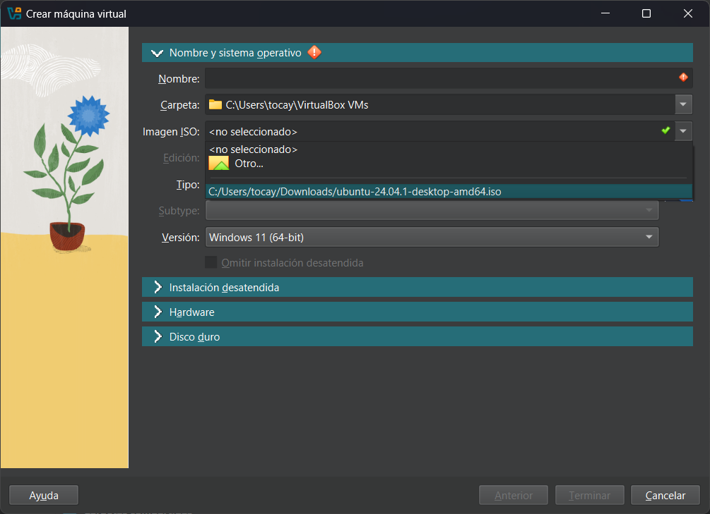

Como siguiente paso presionamos la pestaña “Instalación detenida” e ingresamos el nombre de usuario del perfil en Ubuntu y la contraseña: 
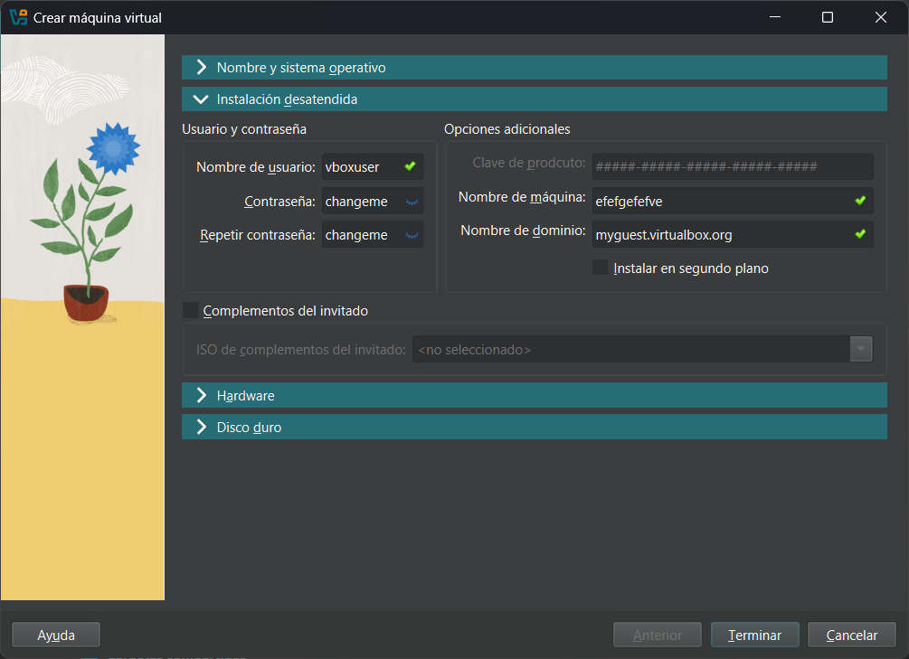

En la pestaña “Hardware” seleccionamos la cantidad de memoria RAM y de CPU le destinaremos a la maquina: 
***IMPORTANTE:*** **El rango de ambas debe de ser dentro de lo recomendado (barra verde), si se exceden estos valores podrían haber problemas de ralentización o de sobrecalentamiento.** 
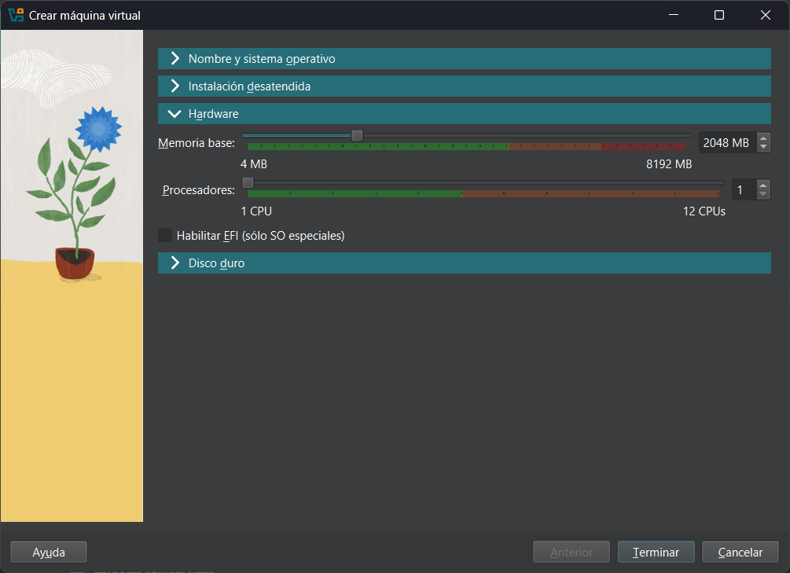

Una vez destinada la correcta cantidad de memoria seleccionamos la pestaña “Disco duro”:
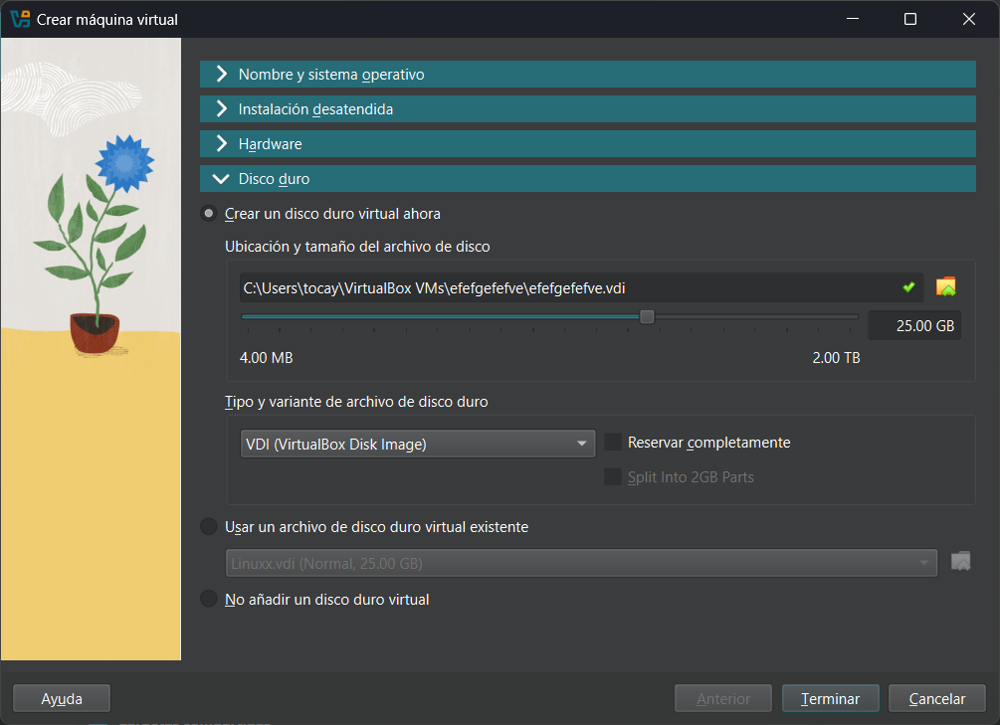

Por último, presionamos el botón “Terminar” y ejecutamos la máquina.
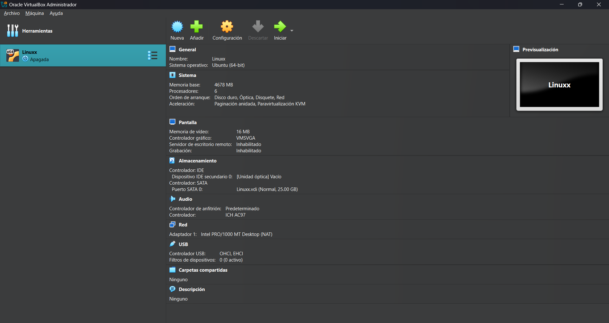

### Uso de la terminal en Ubuntu
Hacer uso de la terminal en Ubuntu es indispensable para optimizar procesos de creacion, eliminacion y edicion de archivos o carpetas, inclusive de acciones mas administrativas. A continuación se mostrarán los comandos más importantes: 

* **Navegar entre archivo y directorios**
    * Para esta acción se utiliza el comando "***cd***":
    * Para retroceder una ubicación "***cd ..***"
    * Para ir al directorio raíz "***cd /***"
    * Para ir al directorio personal "***cd ~***"
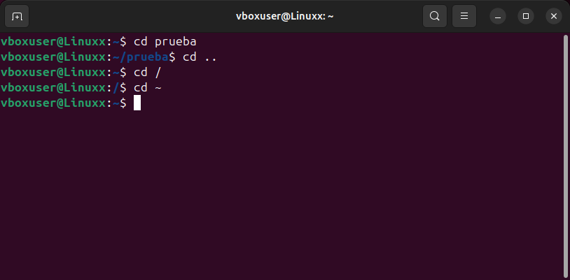

* **Ver el contenido de un directorio**
    * Se utiliza el comando "***ls***"
    * Si se desea con mas información el comando es "***ls -l***"
    * Si se desea ver los archivos ocultos se usa el comando "***ls -la***"
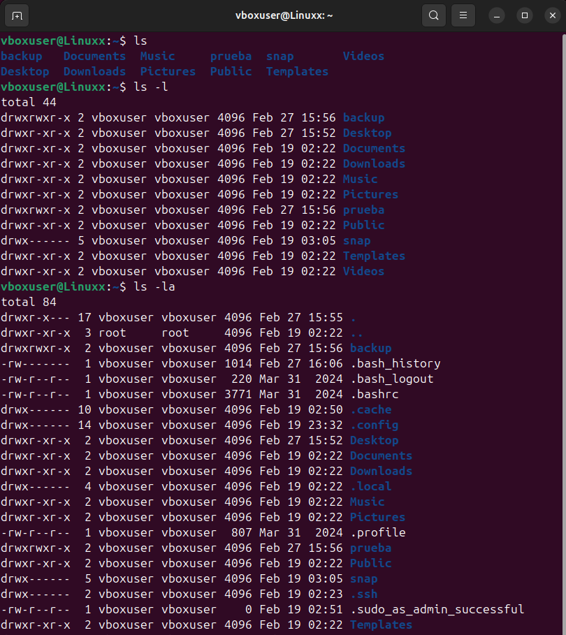

*  **Crear carpetas**
    * Para crear una carperta se utiliza "***mkdir carpeta***"
    * Para crear carpetas consecutivas se usa "***mkdir -p carpeta1/carpeta2***"
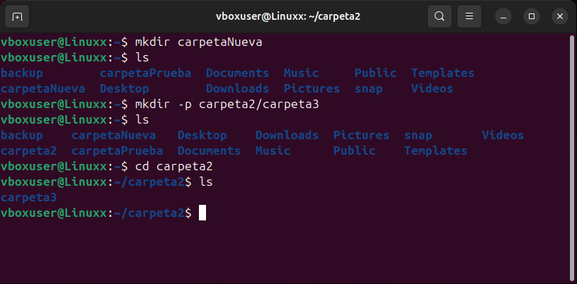

* **Crear y editar archivos de texto**
    * Para crear un archivo vacío se utiliza el comando "***touch ejemplo.txt***"
    * Para editar de manera sencilla un archivo de texto se usa "***nano ejemplo.txt***"
    * Para una edición más avanzada "***vim ejemplo.txt***"
    * Para crear y editar al mismo tiempo "***cat > ejemplo.txt***", luego de       escribir se presiona la combinacion "***ctrl + D***"
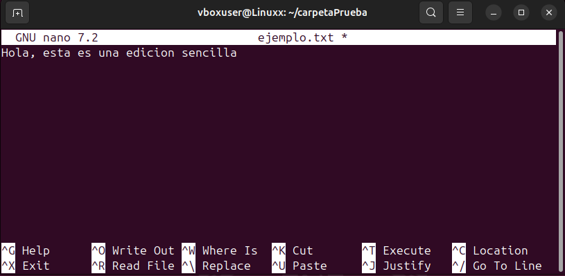
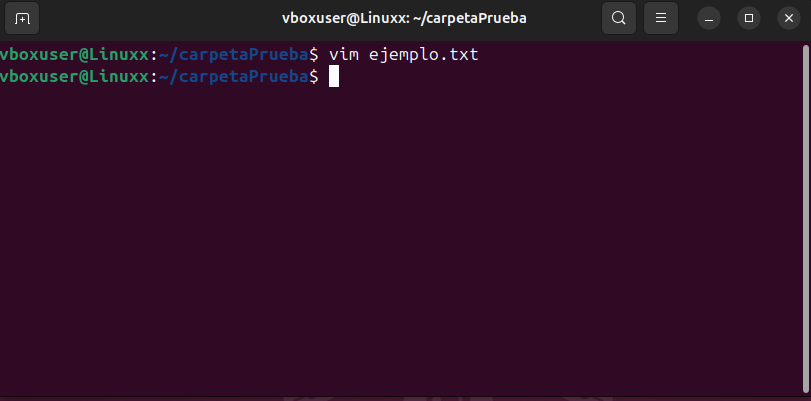
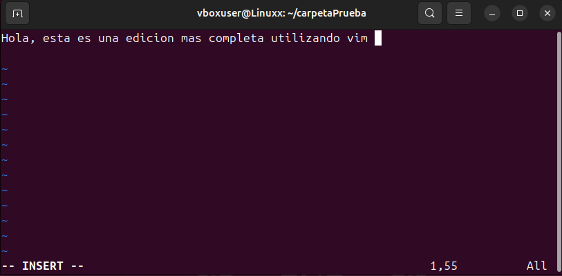

* **Copiar archivos y carpetas a un directorio distinto**
    * Para copiar un archivo se usa el comando "***cp ejemplo.txt/carpeta1/carpeta2/...***"
    * Para copiar una carpeta junto a su contenido "***cp -r carpetaPrueba /carpeta1/carpeta2/...***"
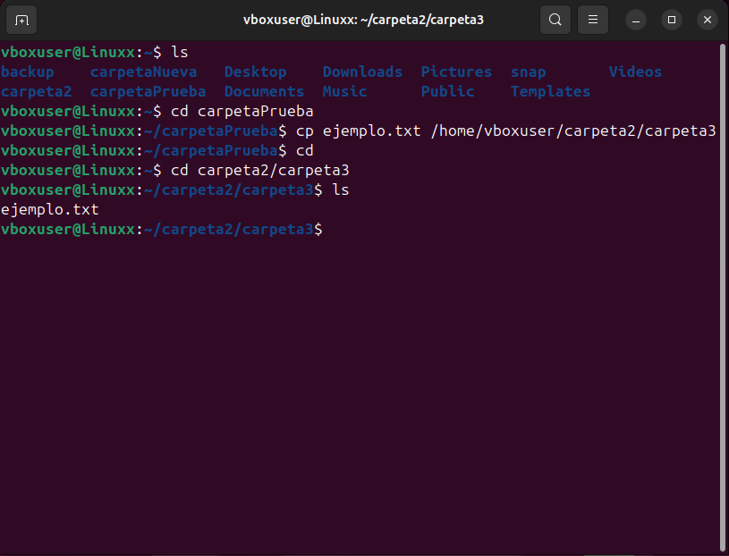
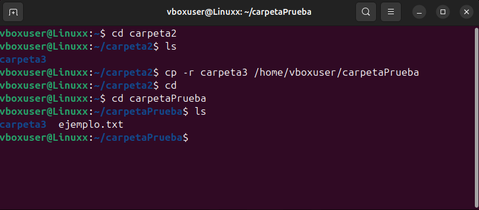

* **Mover carpeta o archivo**
    * Para mover la carpeta "***mv ejemplo.txt | carpeta  /carpeta2/carpeta3/...***"
    * Para mover un archivo y renombrarlo "***mv ejemplo.txt carpeta2/ejemplo_2.txt***"
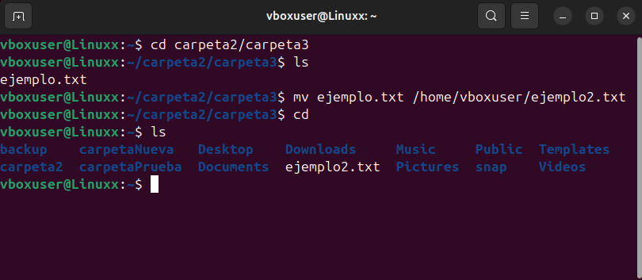

* **Eliminar carpetas y archivos**
    * Para eliminar un archivo se usa el comando "***rm ejemplo.txt***"
    * Para eliminar una carpeta vacia se usa el comando "***rmdir carpeta1***"
    * Para eliminar una carpeta con su contenido se usa "***rm -r carpetaVacia***"
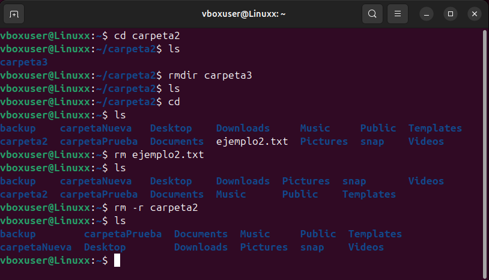

* **Ingresar como superusuario**
    * Para ingresar como superusuario se debe de ingresar el comando "***sudo su***"
    * Para salir del modo superusuario se coloca "***exit***"
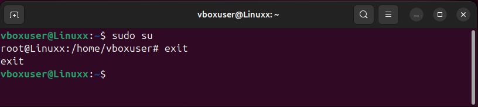

* **Actualizar permisos de archivos o directorios**
    * Para dar permisos de edición a todos los usuarios se usa el comando  "***chmod 777 archivo | directorio***"
    * para dar permisos solo al dueño se utiliza "***chmod 700 archivo | directorio***"
    * Para convertir un archivo a ejecutable "***chmod +x archivo.sh***"

* **Instalar paquetes**
 * Para ello se utiliza el comando "***sudo apt install paquete***"

* **Actualizar paquetes**
 * Para atualizar la lista de paquetes disponibles se utiliza el comando "***sudo apt update***"
 * Para actualizar todos los paquetes se utiliza "***sudo apt upgrade***"
 * Para actualizar el sistema por completo se usa el comando "***sudo apt full-upgrade***"

 * **Eliminar paquetes instalados**
    * Para ello se utiliza el comando "***sudo apt remove paquete***"
    * Para eliminar el paquete junto a su configuración se usa "***sudo apt purge paquete***"
    * Para eliminar paquetes innecesarios "***sudo apt autoremove***"

    ### Levantar un servidor 
    A continuación se mostrarán los pasos para iniciar un servidor de Apache: 

    * Como primer paso, debemos actualizar la lista de paquetes disponibles: 
    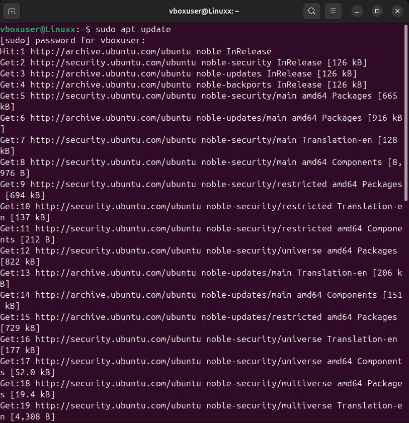

    * Luego se instala Apache2 usando la terminal: 
    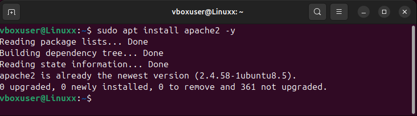

    * Con esto hecho el servidor debería de estar ejecutandose correctamente, para verificarlo hacemos lo siguiente: 
    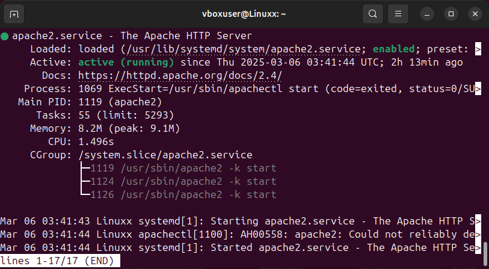

    * Una vez instalado y corriendo con normalidad, ingresamos al navegador e ingresamos lo siguiente: *http://localhost*. Deberia mostrar la página de bienvenida de apache o un archivo html modificado previamente.
    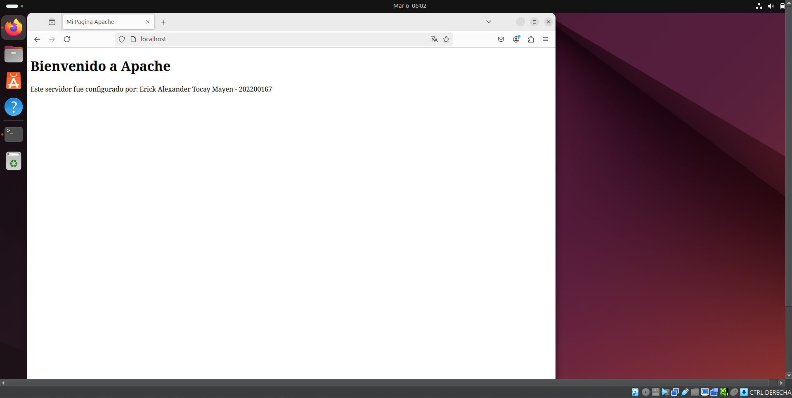